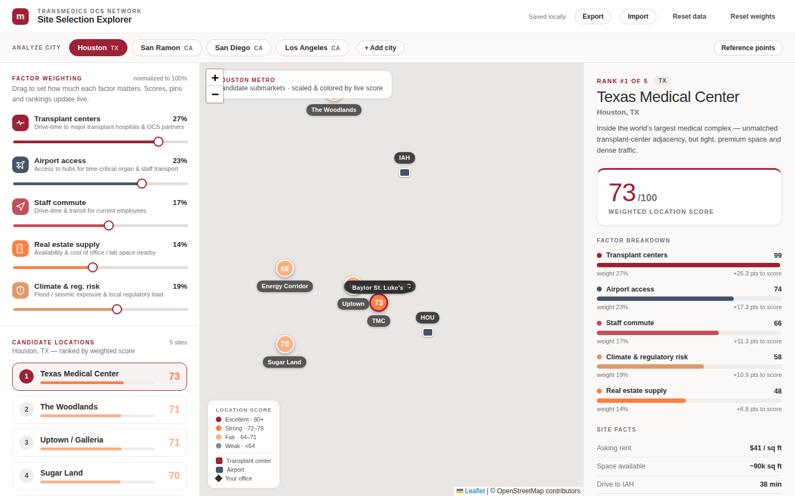

# Site Selection Explorer

Internal decision-support tool for the **TransMedics OCS Network** real-estate /
site-selection team. Weight the factors that matter for a new office/lab
location, then rank candidate submarkets in a metro against each other on a live
weighted score — shown on an interactive map alongside the relevant transplant
centers, airports, and your current office as reference points.

This is a React + TypeScript implementation of the Claude-designed prototype
(`Site Selection Explorer (App).html`), rebuilt on a real component/state/data
layer with [react-leaflet](https://react-leaflet.js.org/) for the map.



## Features

- **Live weighted scoring.** Factor sliders (transplant centers, airport access,
  staff commute, crime & safety, and an optional real-estate supply) write raw 0–100 weights that
  are normalized to 100%. Composite = Σ(rawFactorScore × normalizedWeight).
  Changing any slider re-scores, re-ranks, and re-sizes/re-colors the map pins
  instantly. (Sites saved before a factor existed treat it as a neutral score
  until set.)
- **Optional real-estate factor.** Real-estate supply is opt-in: tick its
  checkbox in the weighting rail to include it in the analysis (there's no live
  CRE data feed, so its score is entered by hand per site). Unchecked, it's
  excluded from the composite and the weights renormalize across the remaining
  factors.
- **Interactive map.** Pannable OpenStreetMap basemap with score-scaled candidate
  pins, transplant-center and airport markers, and an optional office diamond.
  Click a pin or a ranking row to select a site. **Fit all sites** zooms/pans to
  frame every candidate across the greater metro at once.
- **On-map location search.** A search box on the map geocodes any place or
  address (Google Geocoding API), flies there, and drops a blue pin — for looking
  around a real location, with a one-click **Add as candidate site**.
- **Suggest ideal office location.** Computes the point that best balances the
  weighted factors — nearest transplant center, nearest airport, and headcount-
  weighted staff commute — across your reference points and plotted staff, and
  marks it with a gold ★. It's a fast straight-line estimate (weighted by your
  sliders); add it as a candidate and Auto-score it for real traffic-aware times.
- **Greater-metro exploration.** Candidate pins are free-form — drop them
  anywhere in the metro, not just the core city. Each candidate carries an
  editable **city / area** label (e.g. "The Woodlands, TX") shown in the ranking
  and detail panel, so submarkets in surrounding municipalities read clearly.
- **Search-to-add (geocoding).** Type an address or city under Candidate
  locations to geocode it (Google Geocoding API) and drop a scored candidate site
  there — the quickest way to reach surrounding suburbs by name. Enable the
  **Geocoding API** on the key.
- **Location image.** The detail panel shows a **Street View** photo of the
  selected site (via the Google **Street View Static API**), with a **Street /
  Map** toggle and an **Open in Google Maps** link. When no street-level imagery
  exists it falls back to a **Maps Static API** road image. Served through
  `/api/streetview` so the key stays server-side; enable those two APIs on the
  key (see [Environment variables](#environment-variables)).
- **Edit any site.** An **Edit** toggle in the detail panel lets you set each
  factor score (0–100, re-scores live) and edit the name, area, notes, and facts
  (asking rent, available space, …) — for candidate sites and the office. This is
  how you put in real figures, since there's no live real-estate data feed.
- **Auto-score factors.** New sites start at a neutral 70 (flagged **Unscored**
  in the ranking). **Auto-score from drive times + crime** fills five factors for
  every site: transplant-center, airport-access and staff-commute from
  traffic-aware Google drive times (closer = higher, typical weekday-8am), and
  **crime & safety** from a ZIP-level crime API (`/api/crime`, Zyla Labs — each
  site's ZIP is reverse-geocoded when needed, then the violent / property / other
  crime grades map to a 0–100 safety score, weighted 60/30/10 toward violent
  crime for staff safety). The two data sources run independently, so one works
  even if the other's key isn't configured. Real-estate supply, when enabled, is
  set by hand.
- **Office benchmark.** Enable the current office to inject it into the ranked
  list as a "Current" pseudo-site scored on the same factors.
- **Add on map.** Drop new candidate sites, transplant centers, airports, or
  reposition your office by clicking the map. Add new metros via the Add-city
  modal.
- **Find nearby.** Auto-discover reference points around the metro and add them
  (de-duped). **Airports** come from a **bundled OurAirports dataset** (`/api/nearby-airports`)
  — real ICAO/IATA codes, names and coordinates, ranked nearest-first, **no Google
  and no token**. **Transplant centers/hospitals** still use the **Google Places
  API** (no open hospital dataset), so enable the **Places API** on the key for
  those. See [Environment variables](#environment-variables).
- **Airport lookup by ICAO.** In the Airports list, type an ICAO code and
  **Look up ICAO** auto-fills the official name, **exact coordinates**, IATA code
  (used as the map label) and a capability note (type, runway count, longest
  runway) from the **AirportDB.io** API — no manual entry or map-clicking. Served
  through `/api/airport` so the token stays server-side; add an `AIRPORTDB_API_TOKEN`
  (see [Environment variables](#environment-variables)).
- **Rank reference points by importance.** Transplant centers and airports are
  ranked by **list order — drag the ⠿ handle to reorder**. The transplant and
  airport access scores are a **rank-weighted** average of the per-reference
  drive-time scores (rank #1 weighs 5 → last weighs 1), so being near a top-ranked
  hub/center counts for more than a minor one. Higher-ranked markers render larger
  on the map (tagged e.g. "IAH #1"), and the ideal-location suggester weights them
  the same way.
- **TMDX aviation facility.** Alongside the current office, each metro can flag a
  **TransMedics aviation facility** (hangar / air base) — toggled in Reference
  points, placed by clicking the map, shown as a teal marker with its own layer
  toggle. It counts as a **top-weighted airport-access anchor**, so proximity to
  it feeds the airport/transport score and the ideal-location suggester.
- **Drive times (traffic-aware).** Per-site vs. office drive-time comparison
  with a live Δ (green when closer than the office, crimson when farther).
  **Auto-fill** computes driving times from the site and office to every
  transplant center and airport using the **Google Distance Matrix API** with
  live/predictive traffic for a chosen departure time (now, or a typical weekday
  8am / noon / 5pm). Values remain editable by hand. Requires a Google Maps API
  key — see [Environment variables](#environment-variables).
- **Staff locations.** Record how many employees live where (city / state / ZIP +
  headcount) per metro, with a live total — context for the staff-commute factor.
  Managed in the Reference points panel. **Plot on map** geocodes each entry
  (Google Geocoding API) and shows it as a green headcount marker; a "Staff
  locations" layer toggle shows/hides them. **Import from spreadsheet** bulk-loads
  employees from an `.xlsx` / `.xls` / `.csv` file — columns are matched by header
  (city / state / ZIP / headcount, with synonyms) and inferred from the data when
  headers are missing. The parser (SheetJS) is code-split, so it only loads when
  you actually import.
- **Blank slate.** The app starts empty — add cities from scratch. The Add-city
  dialog takes a name, state and **ZIP**, and geocodes the map center from them
  (lat/long optional for exact placement). An empty state prompts for the first
  city; each city tab has a **×** to delete it (and its locations); **Reset
  data** clears everything back to empty.
- **Persistence.** The full state autosaves to `localStorage`. Export downloads
  it as `site-selection-data.json`; Import restores from such a file.
- **Responsive / iOS-ready.** The desktop three-column layout collapses on phones
  (≤820px) into a **Weights / Map / Details** tab switch, with a full-screen
  Reference-points sheet. Handles the iOS Safari `100dvh` toolbar, notch/home
  safe-areas, 16px inputs (no focus-zoom), and touch targets.

## Tech stack

| Concern        | Choice                                             |
| -------------- | -------------------------------------------------- |
| Build tool     | [Vite](https://vite.dev/)                          |
| UI             | React 18 + TypeScript                              |
| Map            | Leaflet 1.9 via react-leaflet 4                    |
| State          | React Context + a single immutable state store     |
| Persistence    | `localStorage` + JSON export/import                |
| Design tokens  | TransMedics design system (reconstructed as CSS custom properties) |

## Getting started

```bash
npm install
npm run dev      # start the dev server (http://localhost:5173)
npm run build    # type-check + production build to dist/
npm run preview  # preview the production build
```

## Environment variables

| Variable              | Where            | Purpose                                                        |
| --------------------- | ---------------- | -------------------------------------------------------------- |
| `GOOGLE_MAPS_API_KEY` | server-side only | Drive-time auto-fill (`/api/drivetimes`, Distance Matrix API), Find-nearby discovery (`/api/places`, Places API), search-to-add + map search (`/api/geocode`, Geocoding API), and the detail-panel location image (`/api/streetview`, Street View Static API + Maps Static API). Never exposed to the browser. |
| `AIRPORTDB_API_TOKEN`  | server-side only | Airport lookup by ICAO (`/api/airport`, AirportDB.io) — official name, coordinates, IATA code, runways. Optional; free token from [airportdb.io](https://airportdb.io/). |
| `Crime_DATA`           | server-side only | Crime & safety auto-score (`/api/crime`, Zyla Labs "Crime Data by Zipcode"). Optional; without it the crime auto-score is skipped. ZIP reverse-geocoding reuses `GOOGLE_MAPS_API_KEY`. |

**Vercel:** Project → Settings → Environment Variables → add the keys
(all environments) → redeploy. In the [Google Cloud console](https://console.cloud.google.com/),
enable the **Distance Matrix API**, **Places API**, and **Geocoding API** on the
Google key, and restrict it.

**Local:** copy `.env.example` to `.env`, fill in the key, and run `vercel dev`
(the `/api` functions do not run under plain `vite dev`). See `.env.example`.

Without a key the app still works — the **Auto-fill** and **Find nearby** buttons
return a clear "add a key" message, and everything else is unaffected.

## Project structure

```
api/
  drivetimes.js         # Vercel function: Google Distance Matrix proxy (traffic)
  places.js             # Vercel function: Google Places proxy (find nearby refs)
  geocode.js            # Vercel function: Google Geocoding proxy (search-to-add)
  streetview.js         # Vercel function: Street View / Static Map location image
  airport.js            # Vercel function: AirportDB.io lookup by ICAO code
  nearby-airports.js    # Vercel function: nearby airports from OurAirports data
  _airports.json        # bundled OurAirports subset (large + medium airports)
  crime.js              # Vercel function: Zyla crime-by-ZIP → safety score
src/
  main.tsx              # entry
  App.tsx               # layout: header, nav, three columns, overlays
  store.tsx             # AppProvider — state, derived scoring, all actions
  types.ts              # domain model
  data/
    factors.ts          # the six weighting factors + defaults + icons
  lib/
    scoring.ts          # normalize / composite / scoreCity / scoreColor
    storage.ts          # load / save / export / import
    drivetimes.ts       # client for /api/drivetimes + departure-time presets
    places.ts           # client for /api/places (find nearby)
    geocode.ts          # client for /api/geocode (search-to-add + map search)
    airport.ts          # client for /api/airport (AirportDB ICAO lookup)
    crime.ts            # client for /api/crime (Zyla crime-by-ZIP)
    staffImport.ts      # parse an uploaded .xlsx/.csv of staff (SheetJS, lazy)
  components/
    Header.tsx          # brand + data actions
    CityNav.tsx         # city tabs + reference-points toggle
    LeftRail.tsx        # factor weighting + ranked candidate list
    MapView.tsx         # react-leaflet map, markers, tooltips, overlays
    Legend.tsx          # score-band + marker-type legend
    RightRail.tsx       # selected-site detail + factor breakdown + drive times
    ReferencePanel.tsx  # editable transplant centers / airports / office
    AddCityModal.tsx    # add-a-metro modal
  styles/
    tokens.css          # design-system custom properties
    global.css          # base + component styles (sliders, buttons, tooltips)
```

## Design tokens

The prototype linked a private `_ds/tmdx-collateral-…` design-system bundle that
is not part of this repository. `src/styles/tokens.css` reconstructs those token
values (crimson `#9D2235`, slate `#44546A`, charcoal `#302F32`, the score-color
scale, Mulish type, etc.) from the design handoff so the UI renders identically.
When the real design-system package is available, replace that file with its
`tokens/*.css` imports and swap the placeholder "m" monogram for the TransMedics
lockup.

## Scoring

- **Weights** are raw 0–100; each factor's effective weight is its share of the
  sum (`normalize`).
- **Composite** for a site = `Σ(score[factor] × normalizedWeight[factor])`,
  rounded.
- **Score colors:** `≥80` crimson (excellent) · `≥72` coral (strong) ·
  `≥64` peach (fair) · else grey (weak).

## Production gaps

Deliberate placeholders carried over from the prototype, to close for
production:

1. **Drive times** — ✅ done. Traffic-aware auto-fill via the Google Distance
   Matrix API (`/api/drivetimes`); manual override still supported. Still to do:
   drive **distances** (miles) alongside times, and caching to limit API calls.
2. **Geocoding** — ✅ done. Search-to-add geocodes typed addresses via the Google
   Geocoding API (`/api/geocode`); click-to-place is still available too.
   Find-nearby (`/api/places`) also auto-discovers transplant centers & airports.
3. **Backend persistence** + multi-user projects/sharing (replace
   `localStorage`/JSON).
4. Marker **drag-to-reposition**, undo, and validation.
5. Editable **factor scores & facts** — ✅ done. The detail panel has an **Edit**
   mode to set each factor score (0–100, live re-score) and edit the site name,
   area, notes, and facts (asking rent, space, …) — for candidate sites and the
   office benchmark. Real-estate figures are still entered by hand (no CRE data
   feed); a commercial provider (CoStar, Crexi, …) could auto-fill them.

## Attribution

Map tiles © OpenStreetMap contributors. The OpenStreetMap attribution control
must be kept. For production, consider a commercial tile provider (Mapbox,
Google) with a styled basemap and an API key.
